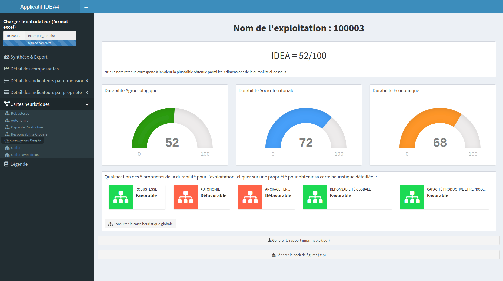
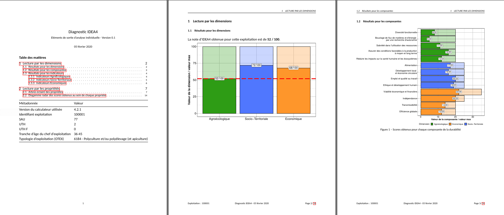

<!-- README.md is generated from README.Rmd. Please edit that file -->

```{r, include = FALSE}
knitr::opts_chunk$set(
  collapse = TRUE,
  comment = "#>",
  fig.path = "man/figures/README-",
  out.width = "100%"
)

library(IDEATools)
```


L'objectif du package IDEATools est de proposer des outils et ressources mobilisables sous R afin de manipuler des données issues d'enquêtes réalisées dans le cadre de la méthode IDEA4, notamment les restitutions graphiques en lien avec l'approche par les propriétés de la durabilité. Ce package est également le support d'un applicatif interactif web basé sur la librairie "Shiny", destiné à proposer une interface simple et intuitive à tout utilisateur non inité à R. 


# Structure globale de l'applicatif

Sept principaux modules (dont un englobant les autres) ont été développés et sont mis à disposition dans ce package :


Il est possible de noter pour un utilisateur averti de R que cette structuration s'inscrit dans une philosophie "tidyverse". En effet, il est possible d'enchaîner l'ensemble des modules en une ligne en faisant appel aux pipes ` %>% `:

```{r eval = FALSE}
### Ne pas exécuter, ceci est un exemple
library(IDEATools)

importIDEA("data.json") %>% MakeTrees() %>% exportIDEA()

```

## Description des modules

### `importIDEA()`
Ce premier module sert à l'import des données issues d'un calculateur IDEA4. Il a également été décidé de procéder à la suite de l'import à l'évaluation par les propriétés en s'appuyant sur :

1. Une table fixant les seuils permettant d'attribuer une des quatre modalités "Favorable", "Intermédiaire", "Défavorable" ou "Très défavorable" à chacun des 53 indicateurs. Cette table est une donnée interne au package mais consultable une fois le package installé :

```{r}
library(IDEATools)

data("categ")

head(categ)
```

2. L'ensemble des 46 tableaux de contingence qui sont stockés sous forme de liste comme données interne au package mais consultables librement :

```{r include = FALSE}
decision_rules_total <- decision_rules_total[1:46] 
```

```{r eval = FALSE}
data("decision_rules_total")
```

```{r}
names(decision_rules_total)

head(decision_rules_total$node_1)
```

Les formats d'entrée acceptés sont le format natif du calculateur (.xls), mais également le format excel plus récent (.xlsx) ainsi qu'un format de fichier plat directement exportable depuis les dernières versions du calculateur : .json.
La logique appliquée par l'algorithme pour récupérer les différentes données est la suivante :


- S'il s'agit d'un fichier .json, alors `jsonlite::fromJSON()` permet d'importer le fichier en toute simplicité.


- S'il s'agit d'un fichier excel (.xls ou .xlsx), utilisation de `readxl::read_excel()`:
  - Si le numéro de version indiqué dans l'onglet 'Notice' est supérieur à la version 4.2.0, alors l'algorithme ira chercher les données dans l'onglet 'Renvoi BDD'. 
  - Si le numéro de version est inférieur à 4.2.0 ou inexistant, alors un algorithme alternatif ira chercher les métadonnées dans l'entête de l'onglet "Saisie et calculateur", puis les scores déplafonnés dans les bilan de chaque dimension et les résultats plafonnés dans l'onglet du bilan global de la durabilité. Selon l'ancienneté du calculateur inséré, il est donc possible que certaines données soient manquantes (en particulier les métadonnées).

Les imports issus de fichiers excels ont été standardisés pour être identiques à l'import Json. Ainsi, quel que soit le format d'entrée, le fonctionnement des modules suivants reste toujours identique. 

> **Attention : L'import sera interrompu dès que la moindre donnée relative aux indicateurs ou à certaines métadonnées clés (ex : présence d'élevage ou non) sera manquante.**

En ce qui concerne le nom de l'exploitation (ou l'id si le format est de type json ou calculateur excel > 4.2.0), une absence d'information sera traduite par la création d'un code aléatoire à 5 lettres. Si vous décidez de forcer un import anonyme (en utilisant le second argument du module, `anonymous` qui est un booléen), alors ce code aléatoire sera affecté à l'exploitation même si il existe un identifiant renseigné.

> **Attention à bien indiquer un identifiant (nom ou id) unique pour votre calculateur si il ne doit pas être anonyme, au risque de fusionner involontairement des calculateurs différents dans les modules suivants.**

Les packages R mobilisés dans ce module sont :

- `readxl` pour la lecture de fichiers excels et `jsonlite` pour les fichiers .json
- `dplyr`, `tidyr`, `stringr` et `janitor` pour la manipulation de données

Dans le cadre du développement de ce package, 3 fichiers de données (correspondants aux 3 possibilités d'import mentionnées plus haut) ont été utilisés et sont accessibles dans le répertoire source du package :

```{r, eval = FALSE}
# Renvoie la localisation du fichier. Ce chemin peut directement être inséré dans le module d'import IDEA
chemin <- file.path("example_json.json", package = "IDEATools") 

IDEAdata <- importIDEA(chemin)

```

En plus d'un import "simple", ce module permet également d'importer un répertoire entier, mêlant les 3 types de fichiers de données.

Dans ce module, comme pour tous les autres, la procédure de traitement de fichiers multiples a été traitée par le développement d'un sous-module de traitement simple (un fichier à la fois) qui est appliqué de manière itérative sur chaque fichier grâce aux fonctionnalités du package `purrr`. Ces résultats sont ensuite ré-agrégés dans le cas d'imports multiples.


### `MakeTrees()` 

Ce module permet la construction de cartes heuristiques colorées à partir de données importées par le module précédent. Différentes approches faisant appel à la librairie `ggplot2` ont d'abord été explorées pour cette fonctionnalité, avant d'être remplacées par une procédure plus complexe s'appuyant sur du dessin vectoriel .svg.
Des modèles (ou canvas) non colorés ont d'abord été dessinés sous le logiciel Inkscape. Un identifiant unique a été assigné à chaque rectangle afin de pouvoir lier chaque rectangle à l'indicateur qu'il représente. Le code source svg (donc type XML) de chacun de ces canvas a été sauvegardé sous forme de liste comme ressource interne de ce package. Pour information, une balise de rectangle au format svg s'écrit comme suit :

```
<rect
       style="fill:#ffffff;fill-opacity:1;stroke:#001800;stroke-width:0.14778921"
       id="rect2-16"
       width="17.833706"
       height="4.9643545"
       x="370.30774"
       y="143.9761"
       inkscape:label="#rect2-16" />
```

L'algorithme va ensuite détecter dans le code source de chaque canvas les balises relatives aux rectangles (`<rect[...]/>`), y chercher l'id de l'objet et puis la ligne relative au remplissage de l'objet (`style="fill:#ffffff"`) avant de remplacer ce code hexadécimal par la couleur correspondant à l'évaluation proposée par l'IDEA à l'indicateur concerné.

Ce code source "modifié" est donc stocké dans la liste renvoyée par ce module. Celui-ci sera ensuite transformé en image réelle (png/pdf) par le dernier module d'export.

Les packages ici utilisés sont principalement `stringr` pour la manipulation des chaînes de caractères puis `dplyr` pour la manipulation des tableaux de manière générale. Enfin, `purrr` est ici aussi utilisé dans le cas du traitement simultané de plusieurs fichiers de données.


### `dimensionsPlots()` 

De la même manière que le module de production des cartes heuristiques, ce module s'appuie sur les données importées par le premier module. En revanche, celui-ci est très majoritairement basé sur la librairie `ggplot2` pour la production de 5 graphiques relatifs à l'approche par les dimensions :

- Vision globale des 3 dimensions
- Vision des 13 composantes
- 3 graphiques de vision des indicateurs de chaque dimension, regroupés par composante.

Ce module renvoie une liste de ggplots, qui pourront être exportés en fichier concret (png/pdf) par le module d'export.

Ici encore, `purrr` est utilisé dans le cas du traitement simultané de plusieurs fichiers de données. `dplyr` et `tidyr` pour le remaniement des données.

### `radarPlots()` 

Ce module est très similaire au module précédent car lui aussi basé sur `ggplot2`.

> Derrière l'intitulé de "radar", ce ne sont en fait pas des diagrammes radar qui sont réalisés, mais en réalité des diagrammes en barres ayant subi une rotation polaire. En effet, les radars sont de moins en moins utilisés car il est admis que leur interprétation (notamment en termes d'aire) peut totalement varier selon le positionnement des variables.

Cette représentation graphique circulaire n'étant pas compatible avec un affichage du libellé complet des indicateurs, une table a été adjointe à chaque graphique afin de traduire chaque code indicateur en libellé complet. Les couleurs des lignes ce ces tables ont été programmatiquement colorées pour correspondre à la dimension d'appartenance de l'indicateur.

Pour ces graphiques, les scores de chaque indicateur sont standardisés en % de la note maximale afin d'être représentés sur une échelle commune. Par soucis de visibilité, il a également été décidé de ne pas afficher les pourcentages inférieurs à 5%.

Ce module renvoie une liste de ggplots, qui pourront être exportés en fichier concret (png/pdf) par le module d'export.

Dans la production de ces 5 radars (relatifs aux 5 propriétés), `purrr` a à nouveau été utilisé dans le cas du traitement simultané de plusieurs fichiers de données. `dplyr` et `tidyr` pour le remaniement des données.

### `metaIDEA()` 

Ce module est le plus récemment développé et est également basé sur `ggplot2`.

Ce module particulier est dédié à l'analyse de collectifs et n'est donc utilisable que dans une situation d'import de plusieurs fichiers en simultané. Par soucis de cohérence, le nombre minimal de fichiers a été fixé à 3.

Deux matrices (ou heatmap) sont proposés par ce module pour l'approche par les propriétés, ainsi qu'un diagramme en barres empilées pour l'approche par les dimensions.

Ce module est encore en version provisoire, et sera développé plus en profondeur au fil des réflexions des concepteurs de la méthode sur les analyses de groupe à proposer. 

Ce module renvoie une liste de ggplots, qui pourront être exportés en fichier concret (png/pdf) par le module d'export.

Une fois encore, `tidyr` et `dplyr` ont été utilisés pour la manipulation des données.


### `exportIDEA()` 

Ce dernier module permet d'exporter les résultats issus des 4 précédents modules sous forme de fichiers graphiques (svg, png ou pdf).

Le module d'export va lancer différents algorithmes en fonction du type de graphiques qui sont introduits :

- S'il s'agit d'une liste de ggplots (produits par `dimensionsPlots()`, `radarPlots()` ou `metaIDEA()`), alors les différents graphiques vont être exportés dans le dossier défini par l'utilisateur dans l'argument `outdir`. Par défaut, si aucune indication n'est donnée par l'utilisateur, ce dossier de sortie prendra la forme "RES_{date}/". A noter que les résultats seront ensuite exportés dans un sous-dossier correspondant à l'identifiant de l'exploitation (ce qui permet de séparer les résultats dans le cas d'un traitement multiple). La principale fonction ici utilisée est `ggplot2::ggsave()`. 

- S'il s'agit de code source svg produit par `MakeTrees()`, alors les graphiques sont exportés par des fonctions issues du package `rsvg`, à savoir `rsvg::rsvg_pdf` et `rsvg::rsvg_png`.

Les dimensions d'export de chaque graphique ont été choisies et implémentées dans une liste. L'export est ensuite réalisé par l'application des fonctions d'export (`ggsave` ou `rsvg`) combinées à l'approche itérative de `purrr`.

## Exemple concret

Voici un exemple concret de diagnostic complet à partir d'un fichier de données .json

```{r eval = FALSE}
library(IDEATools)

chemin <- file.path("example_json.json", package = "IDEATools") 

IDEAdata <- importIDEA("chemin") 

dimensionsPlots(IDEAdata) %>% exportIDEA()

MakeTrees(IDEAdata) %>% exportIDEA()

radarPlots(IDEAdata) %>% exportIDEA()
```

# Application web interactive

Afin de simplifier l'utilisation de cet applicatif qui, en l'état, est surtout manipulable par des initiés au langage R, un applicatif de calcul basé sur la librairie `shiny` (plus particulièrement sur son extension `shinydashboard`) a été également développé et intégré dans ce package. Celui-ci peut ête exécuté d'une simple commande qui va ouvrir une seconde page Rstudio, qui peut être ensuite ouverte dans votre navigateur web préféré.

> **Note importante : A ce jour, seul un calculateur peut être importé à la fois. Le développement de l'application pour la prise en charge d'imports multiples et de groupe est en cours.**

```{r, eval = FALSE}
runIDEATool()
```



Après avoir importé votre calculateur via le bouton d'import en haut à gauche, l'application devrait au bout de quelques secondes ressembler à la capture d'écran ci-dessus. Vous pourrez alors graphiquement explorer la synthèse des résultats (première page), puis le détail via les différents onglets sur la gauche. A noter qu'il est possible que cliquer sur les icônes synthétiques correspondant aux 5 propriétés afin d'être redirigé vers l'arbre correspondant. Le dernier onglet "Légende" permet de consulter la table complète de correspondance code indicateurs <-> libellés complets.

> Note : chacun des graphiques dans l'application peut être manuellement récupéré par un clic droit > Sauvegarder l'image sous. Néanmoins, il convient de privilégier l'approche ci-dessous permettant de télécharger l'ensemble des figures.

Une fois l'exploration des résultats terminés, ceux-ci peuvent maintenant être exportés de deux façons : 

- Par le biais d'un rapport pré-édité (environ 16 pages) qui sera automatiquement mis à jour avec les données relatives au calculateur importé. Celui-ci présente d'abord les métadonnées générales, puis affiche successivement l'ensemble des graphiques présents dans l'application :



La technologie utilisée est `rmarkdown` qui fait appel à un moteur `LaTeX` pour produire le rapport, ce qui peut expliquer un temps de rendu assez long (jusqu'a 30 secondes). Nous travaillons actuellement sur une façon d'accélérer ce processus.

- Par le téléchargement d'une archive .zip contenant l'ensemble des figures produites par l'applicatif. Afin d'éviter tout conflit de fichiers, les figures sont à nouveau produites avant d'être encapsulées et téléchargées, ce qui demande quelques secondes de calcul côté serveur. Ce délai reste néanmoins plus court que pour la production du rapport automatisé.

Cet applicatif est un programme libre; vous pouvez le redistribuer ou le modifier suivant les termes de la GNU General Public License (GPL) telle que publiée par la Free Software Foundation; soit la version 3 de la licence, soit (a votre gré) toute version ultérieure. Ce travail est diffusé dans l’espoir qu’il sera utile, mais sans aucune garantie de qualité marchande ou d’adéquation à un but particulier.

En cas de problèmes rencontrés avec l’outil, contacter :

- David Carayon <david.carayon@inrae.fr>
- Sydney Girard <sydney.girard@inrae.fr>
- Frédéric Zahm <frederic.zahm@inrae.fr>

# Références

David Carayon (2020). IDEATools: Ressources et outils pour le traitement de données IDEA4. R package version 1.0.

Zahm et al. (2019). "Évaluer la durabilité des exploitations agricoles. La méthode IDEA v4, un cadre conceptuel combinant dimensions et propriétés de la durabilité" in Cahiers Agricultures, 8(5):1-10.
