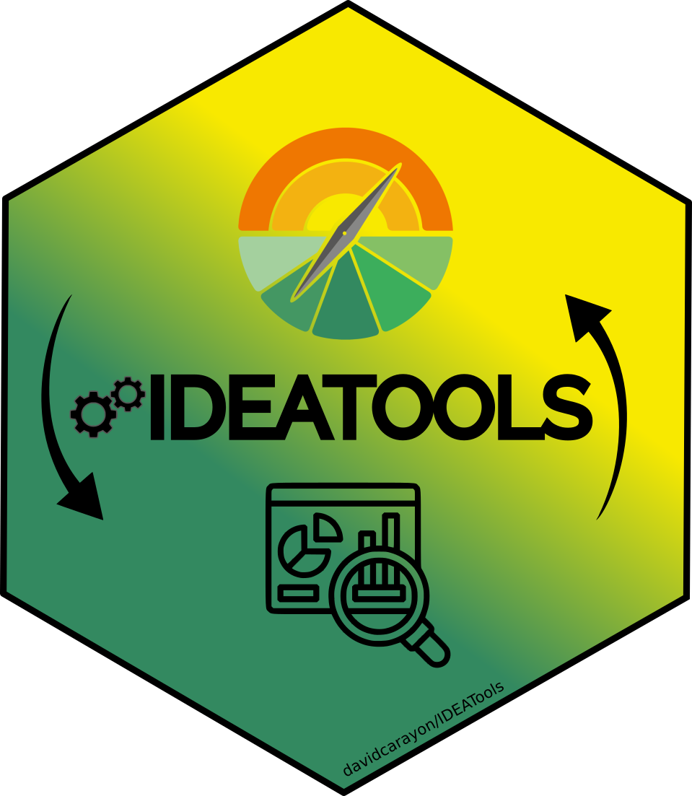

<!-- README.md is generated from README.Rmd. Please edit that file -->

```{r, include = FALSE}
knitr::opts_chunk$set(
  collapse = TRUE,
  comment = "#>",
  fig.path = "man/figures/README-",
  out.width = "100%",
  eval = FALSE
)

library(IDEATools)
```

# IDEATools 

<!-- badges: start -->
[](https://www.tidyverse.org/lifecycle/#maturing)
[](commits/master)
[](https://www.gnu.org/licenses/gpl-3.0.en.html)
<!-- badges: end -->

IDEATools est un package R mettant à disposition des outils mobilisables sous R afin de manipuler, analyser et visualiser des données issues d’enquêtes réalisées dans le cadre de la méthode IDEA4.

# Installation

En attendant sa publication officielle sur le CRAN, vous pouvez télécharger et utiliser la version en cours de développement depuis GitHub avec :

```{r eval = FALSE}
# install.packages("devtools")

devtools::install_github("davidcarayon/IDEATools")
```

# Utilisation

Au total 10 fonctions ou "modules" ont été développés dans ce package, allant de l'import des données d'un calculateur à la production de graphiques puis à la productions de produits de reporting (PDF, excel, etc.).

Afin de simplifier l'utilisation du package, des fonctions "globales", qui encapsulent les plus petits modules, ont été programmées et sont conseillées.

Dans le cas d'une analyse individuelle :

```{r}
library(IDEATools)

# Diagnostic complet, il suffit de modifier les booléens (TRUE/FALSE) pour indiquer quels graphes produire.
DiagIDEA(input = "calculateur.xls", output = "sorties", dimensions = TRUE,
         polar=TRUE, trees=TRUE, radar=TRUE, meta = FALSE, export = TRUE)

# Production d'un rapport complet imprimable et d'un fichier excel compilant les résultats
MakeReport(input = "calculateur.xls", output_dir = "sorties")

MakeExcel(input = "calculateur.xls", output_dir = "sorties")
```

Dans le cas d'une analyse de groupe, les fonctions sont identiques, mais on insère cette fois un dossier contenant plusieurs (> 2) calculateurs.

```{r}
DiagIDEA(input = "dossier_calculateurs", output = "sorties", dimensions = FALSE,
         polar=FALSE, trees=FALSE, radar=FALSE, meta = TRUE, export = TRUE)

MakeGroupReport(input = "dossier_calculateurs", output_dir = "sorties")

MakeGroupExcel(input = "dossier_calculateurs", output_dir = "sorties")
```

# Contact

<div align="center">

&nbsp;&nbsp;&nbsp;:e-mail: [Email][Email]&nbsp;&nbsp;&nbsp;|&nbsp;&nbsp;&nbsp;:speech_balloon: [Twitter][Twitter]&nbsp;&nbsp;&nbsp;|&nbsp;&nbsp;&nbsp;:necktie: [LinkedIn][LinkedIn]

<!--
Quick Link
-->
[Twitter]:https://twitter.com/david_carayon
[LinkedIn]:https://www.linkedin.com/in/carayon-david/
[Email]:mailto:david.carayon@inrae.fr


</div>

# Références

Carayon, D., Girard, S., Zahm, F. (2020). IDEATools: Un applicatif pour le calcul, l'automatisation et l'exploitation de données IDEA4. R package version 1.0.

Zahm F., Alonso Ugaglia A., Boureau H., Del’homme B., Barbier J.M., Gasselin P., Gafsi M., Girard S., Guichard L., Loyce C., Manneville V., Menet A., Redlingshofer B., 2019, Évaluer la durabilité des exploitations agricoles. La méthode IDEA v4, un cadre conceptuel mobilisant dimensions et propriétés de la durabilité, Cahiers Agricultures, 28, 5, https://doi.org/10.1051/cagri/2019004.

Zahm et al. (2019). "Évaluer la durabilité des exploitations agricoles. La méthode IDEA v4, un cadre conceptuel combinant dimensions et propriétés de la durabilité" in Cahiers Agricultures, 8(5):1-10.
