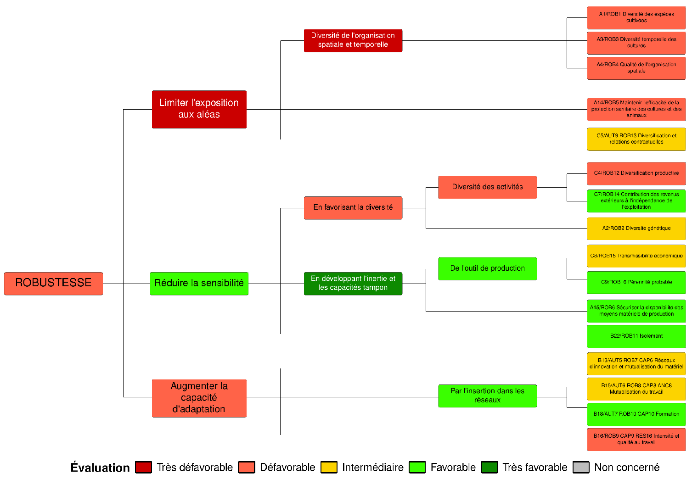
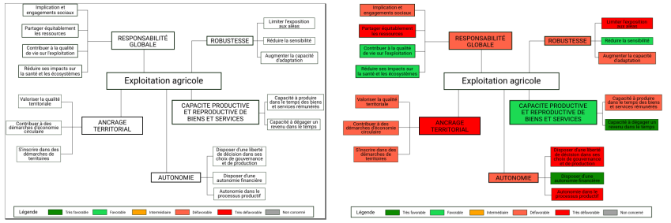

```{r, include = FALSE}
knitr::opts_chunk$set(
  collapse = TRUE,
  comment = "#>"
)
```

## New version (starting with IDEATools 3.0.0)

Instead of using SVG RAW code (which could be tricky when one needed to modify some elements), a new approach only using the {ggplot2} package (along with the {ggtext} extension) was developped.

```{r out.width = "100%", echo = FALSE}

```

This approach is based on simple and reproducible ggplot syntax and based on a few reference dataframes containing coordinates for lines and boxes (nodes) which are stored in the package as internal data that can be exported on your computer by using :

```{r echo = TRUE, eval = FALSE}
IDEATools:::show_tree_structure("my_directory")
```

### How can I modify / translate the colored trees ?

The node labels used in the source code which produces the colored trees are found in another internal object, `reference_list`, which is a list gathering several tibbles with reference info. By modifying the `name` attribute in `$indic_dim`, `$indic_prop` and `$properties_nodes`, you can translate the colored trees which will be produced. 

## Previous version 

The algorithm for producing colored trees was the result of a long work involving the testing of many methods and R packages. The first solution chosen was to draw the models in "white" on a vectorial drawing software (Inkscape) in svg format. SVG is a markup language (similar to XML or HTML) with which it is fairly easy to apply search and replace algorithms. A rectangle tag (corresponding to a node of the illuminated tree) can be written :


    <rect
           style="fill:#ffffff;fill-opacity:1;stroke:#001800;stroke-width:0.1"
           id="rect2-16"
           width="17.833706"
           height="4.9643545"
           x="370.30774"
           y="143.9761"
           inkscape:label="#rect2-16" />

So all we had to do was find the tag for each rectangle, assign each rectangle identifier to its corresponding indicator, then we can search-replace the argument "fill:#ffffff" by the appropriate color corresponding to the evaluation :

```{r out.width = "100%", echo = FALSE}

```

IDEATools then converted this modified SVG source code to a proper PNG/PDF image using the `{rsvg}` library.

The templates were stored as internal object R named "canvas". It was a list containing in each element the complete SVG source code of each template. 
