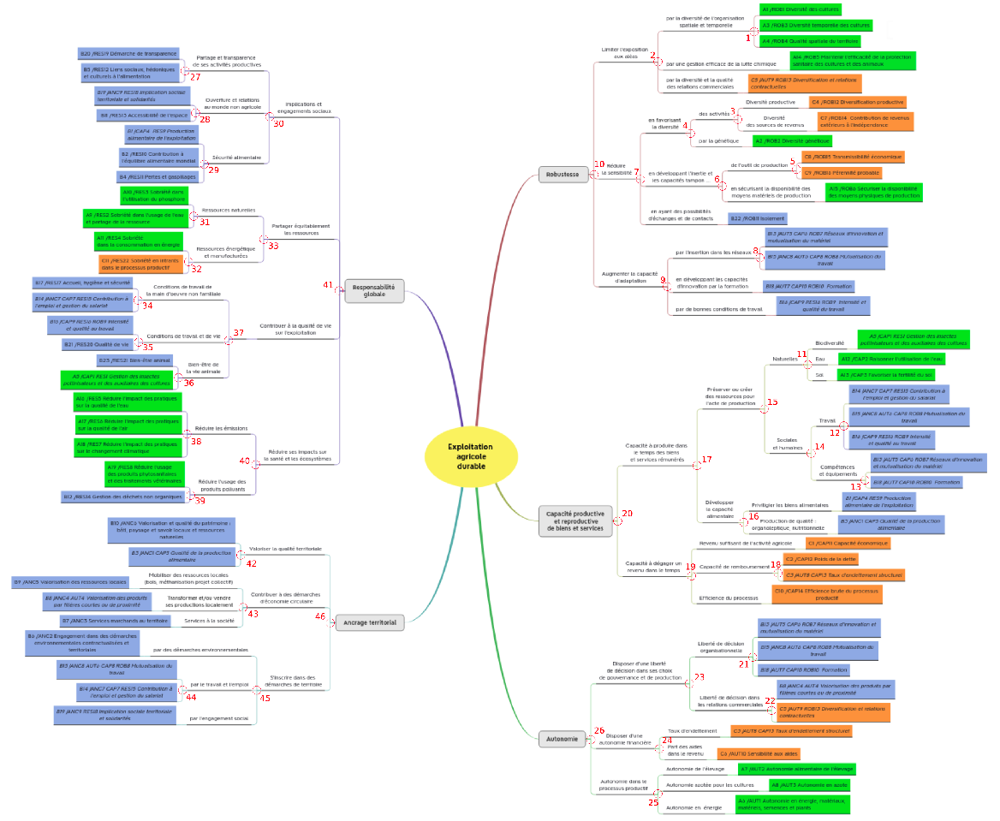

```{r, include = FALSE}
knitr::opts_chunk$set(
  collapse = TRUE,
  comment = "#>"
)
```

The aggregations from items to indicators, components, dimensions and properties are based on **decision rules**.

These decision rules are mainly expert-advice judgment combined with a thorough review of scientific literature.

In IDEATools, the decision rules are stored in an internal object named `decision_rules_total`. This list can be easily exported in the directory of your choice as an excel file using the internal function :

```{r, eval = FALSE}
IDEATools:::show_decision_rules("my_directory")
```

## Decision rules for the Dimensions approach

In the majority of cases, each indicator value can be obtained as the sum of all items related to this indicator. However, there are a few exceptions :

| Indicator | If... (Condition) | Then... (Result) |
|-|-|-|
| A1 | Item2 = 4 | A1 = 4 |
|   | Item2 != 4 | A1 = sum(items) |
| A5 | MTD_15 >= 0.75 | A5 = 5 |
|   | MTD_15 < 0.75 | A5 = sum(items) |
| A7 | MTD_14 = 0  | A7 = 0; |
|   | MTD_14 = 1,  | A7 = Item2 |
|   | MTD_14 = 2  | A7 = 0.7xItem1 + 0.3xItem2 |
| A8 | MTD_15 >= 0.95 | A8 = 8 |
|   | MTD_15 < 0.95 | A8 = sum(items) |
| A14 | MTD_16 = 0 | A14 = 4 |
|   | MTD_14 = 0  | A14 = Item1 |
|   | MTD_16 != 0 AND MTD_14 != 0 | A7 = min(items) |
| A19 | MTD_14 = 0   | A19 = Item1 |
|   | MTD_14 != 0   | A19 = min(items) |
| B2 | MTD_14 = 0 | B2 = Item2 |
|   | MTD_14 != 0 | B2 = Item1 |
| B23 | MTD_14 = 0  | B23 = Item2 |
|   | MTD_14 != 0 | B23 = round(mean(items)) |


## Decision rules for the Properties approach

For the properties approach, the decision rules are 46 data frames giving the evaluation for each node depending on the previous leaves and nodes, named with the pattern "node_xx", based on this numeration of the heuristic tree :

```{r out.width = "100%", echo = FALSE}

```
